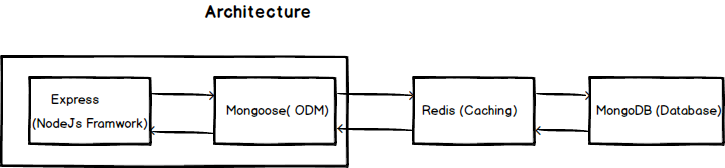

## Architecture



* [Express](https://expressjs.com/)- Nodejs framwork for building the REST Apis
* [Mongodb](http://mongodb.com/)- Document oriented NoSQL database
* [Mongoose](https://http://mongoosejs.com)- MongoDB object modeling tool
* [Redis](https://redis.io/)- In memory key-value database

#### Clone the project

```sh
# clone it
git clone https://github.com/muhzi4u/express--mongodb-starter.git
cd express--mongodb-starter/
# Make it your own
rm -rf .git && git init
# Install dependencies

yarn install

# Start server

yarn run server
```

## ☑ TODO

* [ ] Documentation
* [ ] CI with Travis
* [ ] Docker

## License

MIT

```

```
